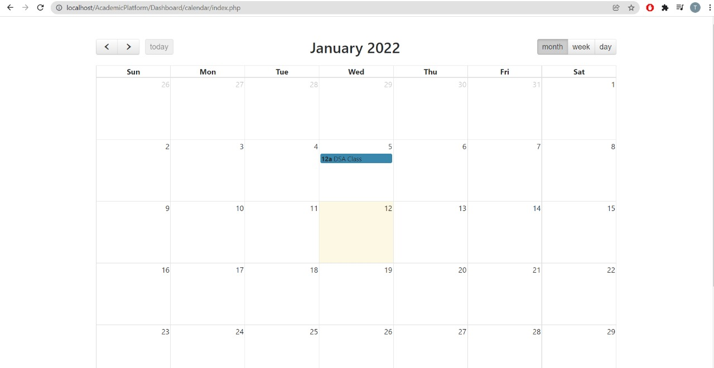

## Welcome to Academic Platform!
Our project is an Academic Portal which will help the universities and the schools to conduct online education efficiently. It will help teachers and students have their courses, and the required material at one place.
We will  give the facility to teachers to add the announcements, assignments, grades and resources of respective courses and students with the facility to access the same. Students can also submit their answer sheets on the portal. Furthermore, a to-do list feature is provided for the students to help keep a check on their due assignments.
It also provides the feature of marking the attendance of students per lecture to the teachers, calendar to add, delete and update the events going on month, week and day wise. 
Facilities like editing the profile, virtual labs where students can code in Python, C++, C, Java, HTML/CSS, React and NodeJS without downloading any IDE and heavy softwares in their systems, E-library in which a students can search up a book and read and download it are provided.

## Technologies used

●      Database: MySQL

●      Frontend: HTML, CSS and Bootstrap

●      Server: Xampp and PHP

## Screenshots & Gif

These are the screenshots of our work -

<!-- 
 -->
  
  
  
<!-- 
 -->

<!-- 
 -->
  
  
  
<!-- 
 -->

<!-- 
 -->
  
  
  
<!-- 
 -->

<!-- 
 -->
  
  
  
  
<!-- 
 -->

